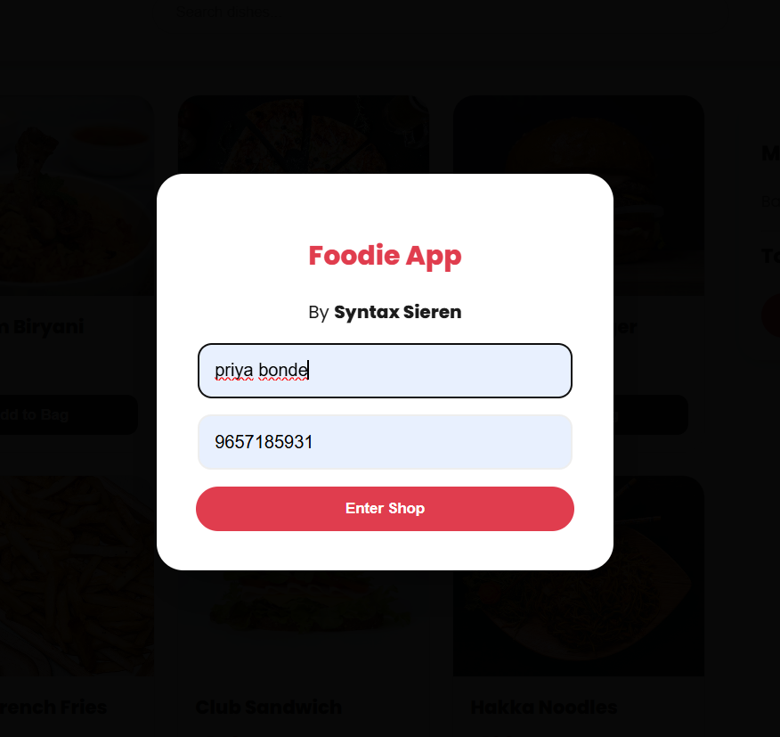
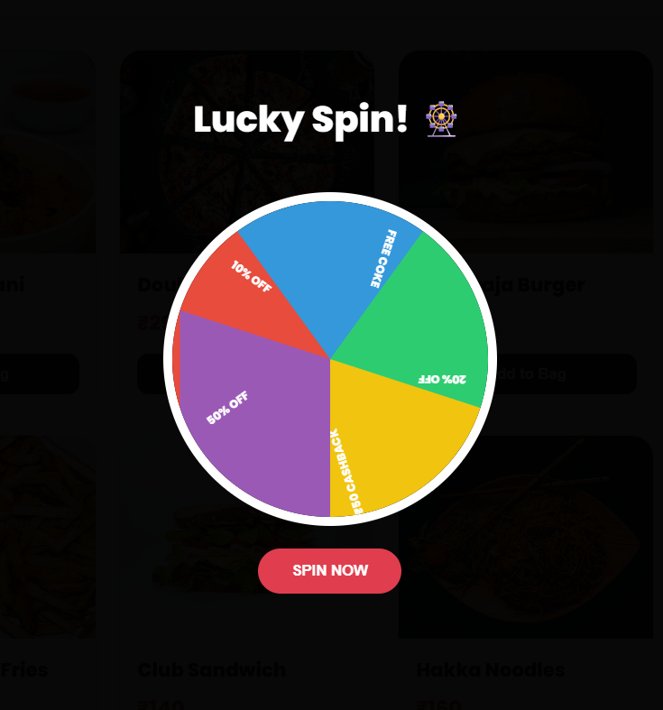
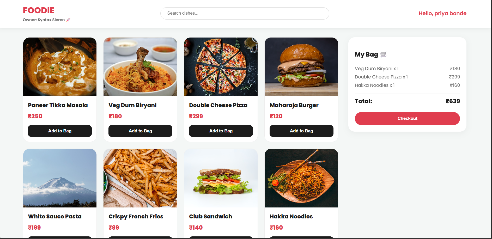
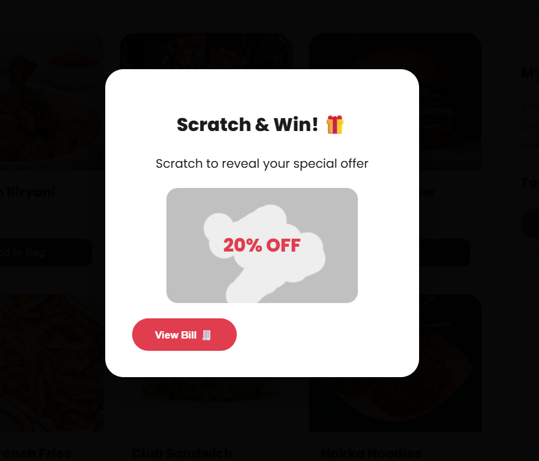
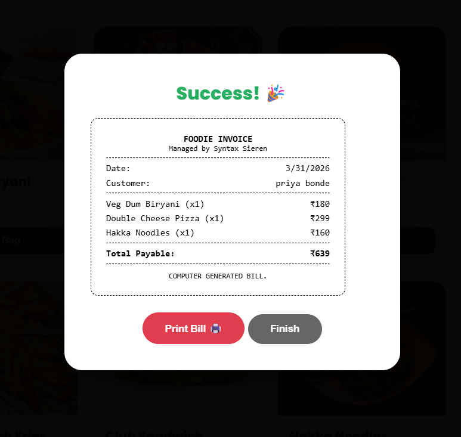

🍔 Food Order System

📌 Description

Food Order System is a web-based application that allows users to browse food items, add them to cart, and place orders easily. This project uses Firebase for backend services like database and authentication.

🚀 Features

- View food menu
- Add items to cart
- Place orders
- Real-time data using Firebase

🛠️ Technologies Used

- HTML
- CSS
- JavaScript
- Firebase

▶️ How to Run

1. Download or clone this repository
2. Open "index.html" in your browser

📂 Project Structure

- index.html → Main file (contains all code)

🔥 Backend

Backend and database are managed using Firebase.

👤 Author

- Priya Bonde

📸 Output Screenshot

